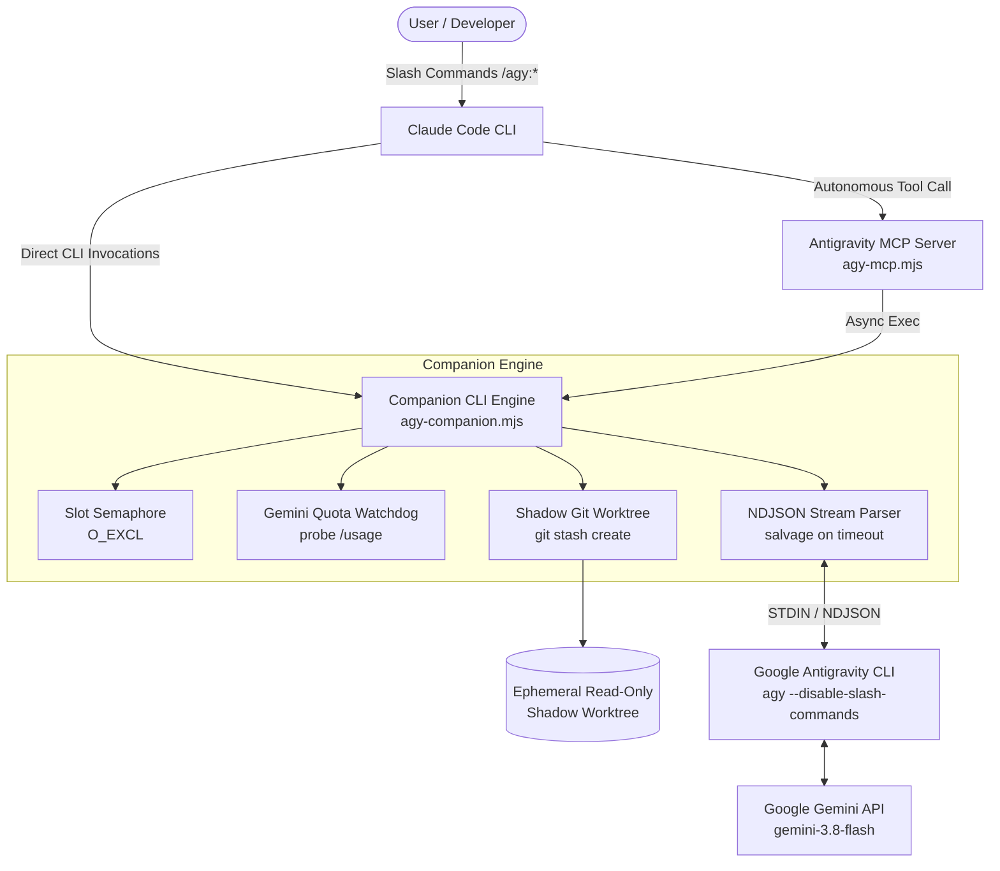

# Antigravity (`agy`) Plugin for Claude Code

[](https://opensource.org/licenses/Apache-2.0)
[](https://docs.anthropic.com/en/docs/agents-and-tools/claude-code)
[](https://antigravity.google)
[](https://nodejs.org)
[](package.json)

🌐 **Language:** English | **[Читать на русском](README.ru.md)**

---

The **Antigravity Plugin for Claude Code** seamlessly bridges Anthropic's **Claude Code** with Google's **Antigravity CLI (`agy`)** powered by the **Gemini 3** family (`gemini-3.8-flash-medium`, `gemini-3.8-flash-low`, `gemini-3.1-pro-high`).

### 💡 The Value Proposition
- **Claude Code** acts as the **Lead Architect & Strategic Brain**: high-level planning, complex reasoning, architectural guidance, and decision making.
- **Antigravity CLI (Gemini)** acts as the **High-Speed Autonomous Workforce**: routine boilerplate implementation, large-scale refactors, extensive code audits, and objective second-opinion code reviews.
- **Dramatically cuts Claude token consumption**: Offloads heavy reading, exploration, and routine diffs to your generous Google Gemini quota while Claude retains full orchestration control.

---

## ⚡ Key Engineering Highlights

| Feature | Description |
| :--- | :--- |
| **Strict STDIN Transport** | Prompts are piped strictly via standard input (`stdin`) with `--disable-slash-commands`. Immune to OS `ARG_MAX` command-line limits and prevents prompt leakage in process tables (`ps`). |
| **Shadow Git Worktree** | Code reviews execute in an isolated ephemeral worktree created via `git stash create`. Your active working tree is 100% physically protected from accidental mutations. Works on unborn branches with aggregate untracked file limits. |
| **Streaming Engine & Recovery** | Real-time NDJSON event reader (`stream-json`). Accumulates `text_delta` tokens and automatically salvages partial output on cascade timeouts. |
| **Atomic Concurrency Semaphore** | `O_EXCL` file locks (`slot-N.slot`) prevent concurrent background tasks from corrupting Antigravity CLI cache files (`last_conversations.json`). |
| **Dual Interface (Human & MCP)** | Full suite of interactive slash commands (`/agy:*`) for humans, plus a zero-latency stdio **MCP Server** (`.mcp.json`) allowing Claude Code to autonomously delegate tasks to Gemini during its thought loop. |
| **Strict Gemini-Only Quotas** | Automated quota watchdog that monitors `/usage` and switches *strictly within the Gemini model hierarchy*, never leaking routine jobs into expensive Claude or GPT pools. |
| **Zero External Dependencies** | Built 100% on standard Node.js built-ins (`node:fs`, `node:child_process`, `node:test`, `node:readline`). Instant startup with zero supply-chain risk. |

---

## 🏗️ Architecture



---

## 🚀 Quick Start (3 Steps)

### Prerequisites
- Node.js >= 18.0.0
- Git
- Google Antigravity CLI (`agy`) installed and authenticated (`agy auth status`)

### Step 1: Add the Marketplace
Inside your terminal or Claude Code session:
```bash
claude plugin marketplace add Basil-AS/antigravity-plugin-cc
```

### Step 2: Install the Plugin
```bash
claude plugin install antigravity@google-antigravity
```

### Step 3: Verify Setup
In Claude Code, run:
```bash
/agy:setup
```
This checks your Node, Git, `agy` binary, Google authentication status, and Gemini quota balance.

---

## 💻 Slash Commands Reference

| Command | Syntax | Description |
| :--- | :--- | :--- |
| **`/agy:setup`** | `/agy:setup [--enable-review-gate \| --disable-review-gate]` | Verifies environment readiness, auth, and quota balance. |
| **`/agy:rescue`** | `/agy:rescue [--write] [--background] [--model <name>] <prompt>` | Delegate a task to Antigravity CLI. Use `--write` to permit file edits or `--background` for async execution. |
| **`/agy:review`** | `/agy:review [--base <ref>] [--dry-run] [--background] [focus]` | Run an objective, schema-validated code review in an isolated shadow worktree. |
| **`/agy:status`** | `/agy:status [job-id] [--all]` | Inspect in-progress and recent background tasks and reviews. |
| **`/agy:result`** | `/agy:result [job-id]` | Retrieve the full formatted output or structured findings of a completed job. |
| **`/agy:cancel`** | `/agy:cancel <job-id>` | Terminate a running background task and cascade-kill its child process tree. |

### Examples

#### 1. Quick Read-Only Codebase Investigation
```bash
/agy:rescue "Analyze src/auth/ and explain how refresh tokens are validated"
```

#### 2. Background Code Implementation (Write Mode)
```bash
/agy:rescue --write --background "Add comprehensive unit tests for lib/tokenizer.mjs"
```

#### 3. Isolated Code Review with Custom Focus
```bash
/agy:review --base main "Focus on edge cases, memory leaks, and input sanitization"
```

#### 4. Instant Dry Run Preview
```bash
/agy:review --dry-run
```

---

## 🤖 Stdio MCP Server (Autonomous Mode)

When Claude Code is reasoning on complex tasks, it can invoke Antigravity tools directly through the local Model Context Protocol (MCP) server defined in `plugins/antigravity/.mcp.json`:

- **`agy_rescue`**: Autonomous worker execution (`prompt`, `write`, `background`, `model`).
- **`agy_review`**: Read-only diff review against a base branch or working tree.
- **`agy_status`**: Poll active jobs and background progress.
- **`agy_result`**: Fetch results upon completion.
- **`agy_cancel`**: Abort jobs if criteria change.

All MCP tool invocations are executed asynchronously with non-blocking I/O, ensuring Claude Code's stdio loop never freezes.

---

## 🛡️ Hooks & Stop-Gate

The plugin bundles lifecycle hooks configured in `plugins/antigravity/hooks/hooks.json`:
- **`SessionStart`**: Automatically initialises workspace state and environment variables.
- **`SessionEnd`**: Safely tears down any remaining background worker processes (`SIGTERM` → `SIGKILL`).
- **`Stop` (Optional Stop-Gate)**: When enabled (`/agy:setup --enable-review-gate`), ensures Claude Code verifies code changes against an objective Antigravity review before concluding its turn.

---

## 🧪 Testing

The test suite validates the stream parser, concurrency semaphores, quota fallback logic, JSON schemas, atomic storage, and companion CLI workflows without external dependencies:

```bash
npm test
```

```text
✔ agy-stream parses full stream-json with result
✔ agy-stream salvages partialText on cutoff/timeout without result envelope
✔ companion setup --json emits valid ready status
✔ companion task --dry-run produces preview without calling LLM
✔ companion review --dry-run produces preview without calling LLM
✔ tryAcquireJobSlot enforces slot limit and releases properly
✔ parsePoolGauge parses tab-delimited usage table
✔ selectGeminiModel enforces Gemini-only models and fallbacks
✔ schema-validate approves compliant object
✔ schema-validate rejects missing fields and extra properties
✔ state module supports per-job isolation and atomic writes

ℹ tests 11
ℹ pass 11
ℹ fail 0
```

---

## 📄 License

Licensed under the [Apache License, Version 2.0](LICENSE).
Copyright 2026 Basil-AS.
