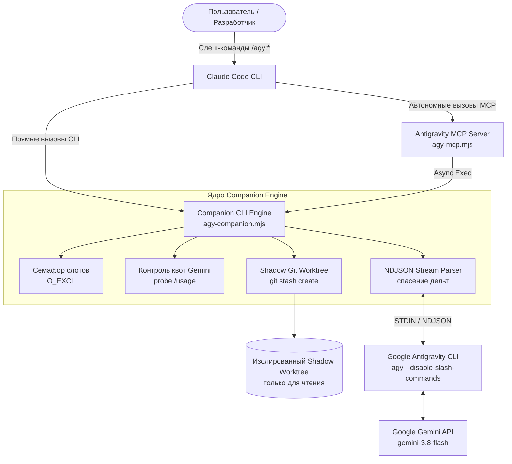

# Плагин Antigravity (`agy`) для Claude Code

[](https://opensource.org/licenses/Apache-2.0)
[](https://docs.anthropic.com/en/docs/agents-and-tools/claude-code)
[](https://antigravity.google)
[](https://nodejs.org)
[](package.json)

🌐 **Язык:** **[Read in English](README.md)** | Русский

---

**Antigravity Plugin для Claude Code** объединяет интеллект **Claude Code** (Anthropic) с мощным консольным агентом **Google Antigravity CLI (`agy`)** на базе линейки моделей **Gemini 3** (`gemini-3.8-flash-medium`, `gemini-3.8-flash-low`, `gemini-3.1-pro-high`).

### 💡 Концепция и выгода (Value Proposition)
- **Claude Code** выступает в роли **Главного Архитектора**: высокоуровневое планирование, анализ сложных инвариантов, принятие ключевых решений и структурирование проектов.
- **Antigravity CLI (Gemini)** выступает в роли **Высокоскоростной Рабочей Силы**: реализация рутинного шаблонного кода, тяжелый рефакторинг, масштабный аудит файлов и независимое код-ревью с альтернативной точки зрения.
- **Колоссальная экономия токенов Claude**: Все объемные операции чтения репозитория, черновой генерации кода и диффов делегируются в высокий лимит квоты Google Gemini, пока Claude держит руку на пульсе.

---

## ⚡ Ключевые инженерные преимущества

| Возможность | Описание |
| :--- | :--- |
| **Строгий STDIN-транспорт** | Промпты передаются исключительно через стандартный ввод (`stdin`) с флагом `--disable-slash-commands`. Это полностью исключает ошибки переполнения командной строки (`ARG_MAX`) в ОС и утечку контекста в таблицу процессов (`ps`). |
| **Shadow Git Worktree** | Код-ревью запускается в полностью изолированном временном ворктри через `git stash create`. Рабочая директория разработчика на 100% защищена от случайных правок. Корректно работает на неинициализированных ветках (unborn HEAD) и имеет лимиты на объем неотслеживаемых файлов. |
| **Потоковый движок и спасение дельт** | Потоковый парсинг NDJSON-событий в реальном времени (`stream-json`). Автоматически накапливает текстовые токены (`text_delta`) и сохраняет частичный вывод даже при наступлении таймаута. |
| **Атомарные семафоры слотов** | Блокировки слотов через атомарный флаг создания файла `O_EXCL` (`slot-N.slot`) исключают гонки и повреждение кэша Antigravity CLI (`last_conversations.json`) при параллельных фоновых задачах. |
| **Двойной интерфейс (Человек + MCP)** | Удобные интерактивные слеш-команды (`/agy:*`) для разработчика + встроенный высокоскоростной stdio **MCP Server** (`.mcp.json`), позволяющий Claude Code автономно вызывать Gemini прямо в цикле своих размышлений. |
| **Квоты только внутри Gemini** | Умный мониторинг квот через бесплатный эндпоинт `/usage`, переключающий задачи *строго внутри семейства Gemini*, никогда не сбрасывая рутину на дорогостоящие пулы Claude или сторонних моделей. |
| **Zero External Dependencies** | Написан на 100% чистом Node.js (`node:fs`, `node:child_process`, `node:test`, `node:readline`). Мгновенный запуск без раздувания `node_modules` и рисков supply-chain атак. |

---

## 🏗️ Архитектура системы



---

## 🚀 Быстрый старт (3 шага)

### Требования к окружению
- Node.js >= 18.0.0
- Git
- Установленный и авторизованный бинарник Google Antigravity CLI (`agy`) (`agy auth status`)

### Шаг 1: Добавление маркетплейса
В терминале или сессии Claude Code:
```bash
claude plugin marketplace add Basil-AS/antigravity-plugin-cc
```

### Шаг 2: Установка плагина
```bash
claude plugin install antigravity@google-antigravity
```

### Шаг 3: Проверка готовности
В чате Claude Code выполните команду:
```bash
/agy:setup
```
Команда проверит наличие Node.js, Git, версию `agy`, статус авторизации в Google и доступную квоту Gemini.

---

## 💻 Справочник слеш-команд

| Команда | Синтаксис | Описание |
| :--- | :--- | :--- |
| **`/agy:setup`** | `/agy:setup [--enable-review-gate \| --disable-review-gate]` | Диагностика готовности окружения, авторизации и баланса квот. |
| **`/agy:rescue`** | `/agy:rescue [--write] [--background] [--model <name>] <промпт>` | Делегирование задачи в Antigravity CLI. Ключ `--write` разрешает правку файлов, `--background` запускает задачу в фоне. |
| **`/agy:review`** | `/agy:review [--base <ref>] [--dry-run] [--background] [фокус]` | Запуск независимого код-ревью со строгой валидацией по JSON-схеме в изолированном ворктри. |
| **`/agy:status`** | `/agy:status [job-id] [--all]` | Просмотр статуса активных и последних завершенных задач и ревью. |
| **`/agy:result`** | `/agy:result [job-id]` | Получение полного форматированного ответа или вердикта ревью завершенной задачи. |
| **`/agy:cancel`** | `/agy:cancel <job-id>` | Принудительная остановка фоновой задачи с каскадным завершением дерева процессов (`SIGTERM` → `SIGKILL`). |

### Примеры использования

#### 1. Быстрый анализ кодовой базы (Read-Only)
```bash
/agy:rescue "Изучи src/auth/ и объясни, как валидируются refresh-токены"
```

#### 2. Фоновое написание кода (Write Mode)
```bash
/agy:rescue --write --background "Напиши модульные тесты для модуля lib/tokenizer.mjs"
```

#### 3. Изолированное код-ревью с фокусом на безопасность
```bash
/agy:review --base main "Сфокусируйся на граничных случаях, утечках памяти и санитизации ввода"
```

#### 4. Мгновенный предпросмотр без вызова LLM
```bash
/agy:review --dry-run
```

---

## 🤖 Stdio MCP Server (Автономный режим)

В ходе решения комплексных задач Claude Code может автономно вызывать инструменты Antigravity через встроенный MCP-сервер, настроенный в `plugins/antigravity/.mcp.json`:

- **`agy_rescue`**: Запуск фонового или синхронного воркера (`prompt`, `write`, `background`, `model`).
- **`agy_review`**: Запуск независимого код-ревью рабочей директории или диффа ветки.
- **`agy_status`**: Опрос состояния активных фоновых задач.
- **`agy_result`**: Получение итогового результата выполнения.
- **`agy_cancel`**: Отмена задачи при изменении требований.

Все вызовы внутри MCP-сервера выполняются асинхронно с неблокирующим вводом-выводом, предотвращая зависание event loop Claude Code.

---

## 🛡️ Хуки жизненного цикла и Stop-Gate

Плагин содержит хуки жизненного цикла (`plugins/antigravity/hooks/hooks.json`):
- **`SessionStart`**: Автоматическая инициализация рабочего пространства и переменных сессии.
- **`SessionEnd`**: Корректная остановка оставшихся фоновых процессов (`SIGTERM` → `SIGKILL`).
- **`Stop` (Опциональный стоп-гейт)**: При активации (`/agy:setup --enable-review-gate`) блокирует завершение ответа Claude Code до тех пор, пока изменения кода не пройдут независимое код-ревью Antigravity.

---

## 🧪 Тестирование

Набор тестов проверяет работу потокового парсера, слот-семафоров, логики ротации моделей Gemini, валидации схем, атомарного хранилища и CLI-компаньона:

```bash
npm test
```

```text
✔ agy-stream parses full stream-json with result
✔ agy-stream salvages partialText on cutoff/timeout without result envelope
✔ companion setup --json emits valid ready status
✔ companion task --dry-run produces preview without calling LLM
✔ companion review --dry-run produces preview without calling LLM
✔ tryAcquireJobSlot enforces slot limit and releases properly
✔ parsePoolGauge parses tab-delimited usage table
✔ selectGeminiModel enforces Gemini-only models and fallbacks
✔ schema-validate approves compliant object
✔ schema-validate rejects missing fields and extra properties
✔ state module supports per-job isolation and atomic writes

ℹ tests 11
ℹ pass 11
ℹ fail 0
```

---

## 📄 Лицензия

Распространяется под лицензией [Apache License, Version 2.0](LICENSE).
Copyright 2026 Basil-AS.
